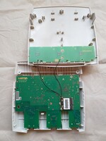
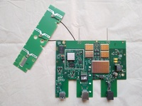
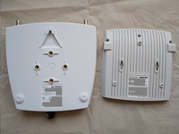

How-to DECT: Setting up a Mitel SIP-DECT RFP for home/enthusiast use
====================================================================

* Table of contents
{:toc}

## Intro

DECT telephony, courtesy of Eventphone, has been a staple of hacker conferences
for [years][ep-history].  
Recently, Eventphone has [improved their registration and management
system][newsys] and [presented more information on its inner workings][mifail].

[ep-history]: https://media.ccc.de/v/35c3oio-70-eventphone-frher-heute-morgen-
[newsys]: https://media.ccc.de/v/eh19-179-das-neue-eventphone-poc-telefonsystem
[mifail]: https://media.ccc.de/v/36c3-10576-mifail_oder_mit_gigaset_ware_das_nicht_passiert

With all this information at the ready, one might decide to try and replicate
the familiar DECT setup at home.  
Even with these excellent (and entertaining!) resources, however, SIP-DECT is
very much an enterprise solution and can be a bit daunting to set up for your
own personal use.  
Think for a few moments whether you really want to go through with this, or if
you already have plenty of other side-projects to occupy your time. Then,
probably, read on. ;)

## Glossary: What is SIP-DECT?

Just to recap:

- **DECT** is a wireless communication standard that is, among other things, used
  for cordless telephones.
- **SIP** is technically only a "signalling protocol" (it does say "Session
  Initiation" in the name), but is colloquially used to refer to network-based
  telephony ("Voice-over-IP") in general.
- **SIP-DECT** is a line of products by *Mitel* (see below) that combines the
  two: SIP-DECT devices act as DECT base stations and SIP clients, allowing
  DECT phones to make calls via a SIP server.
- **Mitel** purchased Aastra in 2013, who had in turn purchased DeTeWe in 2005, so
  you'll find all three company names mentioned somewhat interchangeably when
  it comes to SIP-DECT equipment.

The SIP-DECT setup uses several more terms and abbreviations. You'll primarily
come across:

- **RFP** (Radio Fixed Part):  
  Simply put, a DECT base station.  
  *You can have one or multiple of these.*
- **PP** (Portable Part):  
  A DECT phone handset.  
  *You can have one or multiple of these.*
- **OMM** (Open Mobility Manager):  
  A piece of software (running as a permanent service) that accepts your
  configuration settings, coordinates communication across all *RFP*s, and acts
  as the interface between SIP and DECT. The *OMM* has a web interface that
  allows you to configure most (but not all) settings.  
  *You will usually have one instance of this, possibly with a second instance
  as fallback. You might use the web interface for the inital installation, and
  occasionally for administrative tasks afterwards.*
- **OM Configurator**:  
  A piece of software (an administrative GUI) that allows you to configure
  Mitel *RFP*s' basic settings: IP address, network boot paths, *OMM* addresses
  they should use.  
  *You might need to use this once for the initial installation, then not need
  it anymore.*
- **OMP** (OM Management Portal):  
  A piece of software (an administrative GUI) that allows to configure your
  *OMM*. Similar features to the *OMM*'s own web interface, but some options
  are available only in the web interface, or only in the *OMP*.  
  *You might use this for the inital installation, and occasionally for
  administrative tasks afterwards.*

## Hardware: RFP generations

The SIP-DECT RFP hardware exists in several feature classes and has gone
through several years of development. The model numbers that arise from this
are, shall we say, *creative*.

The naming follows the schema "RFP *number* [IP|WLAN]".  
"IP" models can only act as a DECT base station; "WLAN" models can provide both
DECT base station and WiFi access point service at the same time. Both DECT and
WiFi functionality can be enabled/disabled in the configuration.

There used to be "*number*L" models that included a license for multiple RFPs.
As of SIP-DECT 6.0, licenses are independent from RFP models; there is no
distinction between L- and non-L-RFPs anymore.
(see also: [section "Licensing"](#licensing))

RFPs exist in indoor and outdoor variants (easily distinguished by their smooth
vs rugged case).  
Do not use an indoor variant outdoors; its circuit board will corrode, which is
generally a bad thing.

### Model overview

Let's look at an overview (as of the release of SIP-DECT v8.0):

|                | indoor, 4 speech channels | indoor, 8 speech channels                  | outdoor, 8 speech channels        | identification characteristic      |
|----------------|---------------------------|--------------------------------------------|-----------------------------------|------------------------------------|
| 2nd generation | -                         | 32 IP, 42 WLAN                             | 34 IP                             | smooth edges, no USB port          |
| 3rd generation | -                         | [35 IP][rfp35ip], 43 WLAN                  | 36 IP (PoE-only), 37 IP (ext-ant) | smooth edges, has a USB port       |
| 4th generation | 44 IP                     | [45 IP][rfp45ip], 47 IP (ext-ant), 48 WLAN | 47 IP DRC                         | "modern" angular look, no USB port |

(PoE-only): power only via PoE, no RJ11 power input  
(ext-any): external antenna connector, no internal DECT antenna
IP: only contains a DECT base station  
WLAN: contains both a DECT base station and a WiFi AP  
DRC: preinstalled with directional antennas in an outdoor enclosure

[rfp35ip]: https://www.telefonanlage-shop.de/Aastra-EOL-END-OF-LIFE-TK-Systeme-DECT-Systeme-244/Aastra-RFP-35-IP-indoor-709#link_3
[rfp45ip]: https://www.telefonanlage-shop.de/Aastra-DECT-Systeme-SIP-DECT-RFP-62/Mitel-RFP-45-IP-indoor-2221#link_3

### Selecting an RFP

For a home/enthuasiast setup, you probably won't be too picky about speech
channels and indoor/outdoor variants.
You should, however, pay attention to the generation:

- Gen 2 is pretty much outdated by now — it does not support DECT encryption,
  has to boot via TFTP on each powercycle because it has no internal flash,
  might not support newer OMM versions, etc.
  Basically, avoid it.
- Gen 3 is commonly used by Eventphone — it is new enough to run the latest OMM
  version, and its USB port is very handy for configuration resets, software
  upgrades, and perhaps powering a small router or network switch.
  These should work well for home/enthuasiast deployments like ours.
- Gen 4 is up-to-date and fancy, but doesn't have a USB port, which makes
  software updates a bit more tricky. Configuration resets are done via a
  button, rather than a USB memory stick. Experience with this generation is
  sparse in enthusiast circles, so you might be on your own when you encounter
  difficulties.

### Buying an RFP

RFPs can cost upwards of 450€ per piece when new.  
There is a second-hand market for used devices, but even those are not exactly
"cheap").  
You will usually find several offers for RFPs on common auction sites, but it
may take some patience to find ones in the 100€ range. (The Eventphone
presentation mentions offers around 50€, but those mostly applied to bundles of
multiple RFPs and have become a rare exception now that documentation for
SIP-DECT setups is becoming more accessible.)

As long as the hardware is functional, you should have nothing to worry about:
there are means to reset the configuration even if the seller has not provided
the passwords.

## Plugging it in: Getting your RFP(s) up and running

### Powering the RFP

Gen 2 and 3 RFPs can be powered via Power over Ethernet or via an RJ11 power
connector.  
Gen 4 only supports Power-over-Ethernet.

As a point of reference for power consumption: An RFP 43 WLAN uses about 5.5 W
during normal operation.

All RFPs support Power over Ethernet (PoE) according to the 802.3af standard.  
The RFP generally negotiate as Class 2, i.e. 3.84–6.49 W at the device. RFP 48
(Gen 4 with 802.11ac WiFi) requires slightly more power and negotiates as Class
3 (6.49–12.95 W at the device).

The circuit layout of RFP 37 and 43 suggests that they support both "Mode A" (+
on pin 1&2, - on pin 3&6) and "Mode B" (+ on pin 4&5, - on pin 7&8), as they
have two bridge rectifiers feeding into the internal DC-DC converter.  
Manual testing indicates that PoE voltage can be applied directly (with either
Mode A or Mode B pinout) without going through 802.3af negotiation.  
The RFP requires at least 37 V to function (which matches the [specifications
of the PA1136NL transformer][transformer-schematic] used in the power supply
section).

Gen 2 and 3 indoor RFPs also support direct DC power via an RJ11 connector:

[transformer-schematic]: https://www.digikey.com/en/datasheets/pulse-electronics-power/pulse-electronics-power-p675

### Software update

*TODO*

### Factory reset

*TODO*

### IP configuration

*TODO*

#### OM Configurator

*TODO*

#### DHCP

*TODO*

### OMM on RFP vs stand-alone OMM

*TODO*

### Accessing the OMM

*TODO*

## Software: Configuring the RFP

*TODO*

[sip-dect-manual]: https://www.mitel.com/de-de/document-center/devices-and-accessories/wireless-solutions-and-handsets/sip-dect-multi-cellular-solution/sip-dect

## Phones: Registering a handset and making a call

*TODO*

## More: Larger deployments, SIP servers, and other shenanigans

### Licensing

There used to be "<number>L" models that included a license for multiple RFPs.
As of SIP-DECT 6.0, licenses are independent from RFP models; there is no
distinction between L- and non-L-RFPs anymore.

With the new licensing model, up to 5 RFPs can be used together "out of the
box" without adding an explicit license. (Presumably, this applies to the
number of RFPs connected to the same OMM, regardless of how they are split into
DECT synchronisation clusters.)
For larger deployments, a license file needs to be purchased. The license is
usually tied to the MAC addresses of three RFPs in the deployment (for
redundancy in case one of the licensed RFPs becomes defective/unreachable).
As a ballpark figure, these licenses start at [approx. 530€ for up to 10
RFPs][example-license-offer].

[example-license-offer]: https://www.telefonanlage-shop.de/Aastra-DECT-Systeme-SIP-DECT-Lizenzen-System-91

### Disassembly

#### Outdoor RFPs (e.g. 36/37)

The water-resistant case unscrews with four Phillips screws, contains raw PCB,
fastened with two Phillips screws:

#### Indoor RFPs (e.g. 43)

The case has three Torx T10 screws, two pairs of clips on each side, three
single clips at the back (near the connectors).

### RFP size

Gen 4 RFPs are smaller, see page 25 of [this brochure][sipdect8-overview] for
an example.

[sipdect8-overview]: https://www.groupe-alliance.com/site_7/im/im_bdd/im_accueil/emailings/newsletter-mitel-nov-2019/SIP%20DECT%208.1%20Introduction%20&%20Overview%20-%20EN.pdf
